# Legacy Navigation Flow

> Complete navigation graph of the legacy game.
> All flows verified from Java source click handlers and menu XML.

---

## Navigation Graph (Mermaid)

```mermaid
graph TD
    subgraph "Always Visible HUD"
        HUD_Menu["☰ Menu Button"]
        HUD_Title["Fragment Title"]
        HUD_Gems["💎 Gems Display"]
        HUD_Money["💰 Currency Bar"]
        HUD_Shop["🏪 Shop Icon"]
        HUD_King["👑 King Message"]
        HUD_Merchant["🛒 Merchant"]
        HUD_Quests["📜 Quests"]
        HUD_Ad["📺 Ad/AdFree"]
        HUD_Tutorial["📖 Tutorial"]
    end

    subgraph "Bottom Navigation (4 Tabs)"
        TAB0["🏰 Headquarters"]
        TAB1["⚔️ Adventurers"]
        TAB2["🗺️ Dungeons"]
        TAB3["⚡ Raids"]
    end

    subgraph "Drawer Menu (Slide)"
        DRAW_Shop["Shop"]
        DRAW_Settings["Settings"]
        DRAW_Recall["Recall Adventurers"]
        DRAW_Messages["Messages Received"]
        DRAW_FAQ["FAQ"]
        DRAW_Bestiary["Bestiary"]
        DRAW_Achieve["Achievements"]
        DRAW_Cloud["Cloud Save"]
        DRAW_Redeem["Redeem Code"]
        DRAW_Reddit["Reddit"]
        DRAW_Naver["Cafe Naver"]
    end

    %% HUD Actions
    HUD_Menu -->|"open drawer"| DRAW_Shop
    HUD_Shop --> DialogShop
    HUD_King --> KingMessageAlert
    HUD_Merchant --> DialogMerchant
    HUD_Quests --> DialogQuests
    HUD_Ad --> AdConfirmAlert
    HUD_Gems -->|"tap"| DialogShop

    %% Drawer Actions
    DRAW_Shop --> DialogShop
    DRAW_Settings --> DialogSettings
    DRAW_Recall --> DialogRecallAdventurers
    DRAW_Messages --> DialogMessagesReceived
    DRAW_FAQ --> DialogFaq
    DRAW_Bestiary --> DialogBestiary
    DRAW_Achieve -->|"external"| GooglePlayGames
    DRAW_Cloud --> CloudSaveAlert
    DRAW_Redeem --> DialogRedeemCode
    DRAW_Reddit -->|"external"| RedditBrowser
    DRAW_Naver -->|"external"| NaverBrowser

    %% Headquarters Sub-Screens
    TAB0 --> DialogQuarters
    TAB0 --> DialogTavern
    TAB0 --> DialogStorage
    TAB0 --> DialogMarket
    TAB0 --> DialogWorkshop
    TAB0 --> DialogShelter

    %% Adventurers Flow
    TAB1 --> DialogEntityDetail
    DialogEntityDetail --> DialogSelectEquipment
    DialogEntityDetail --> DialogPromotionChoices
    DialogEntityDetail --> DialogChangeTraitRare
    DialogEntityDetail --> DialogDoctrine
    DialogEntityDetail --> DialogConsumeFood
    DialogEntityDetail --> DialogConsumePotion
    DialogEntityDetail --> DialogConsumePotionOfClumsiness
    DialogEntityDetail --> DialogConsumePotionOfRejuvenation
    DialogEntityDetail --> DialogConsumeIntercession
    DialogEntityDetail --> DialogConsumeEvo23
    DialogDoctrine --> DialogChooseDoctrine
    DialogDoctrine --> DialogDoctrineReset

    %% Item Flow
    DialogSelectEquipment --> DialogItemDetail
    DialogStorage --> DialogItemDetail
    DialogItemDetail --> DialogSell

    %% Dungeon Flow
    TAB2 --> DialogDungeonDetail
    DialogDungeonDetail --> DialogSendTeam
    DialogSendTeam --> DialogChooseAdventurer
    DialogSendTeam --> DialogChoosePet
    DialogDungeonDetail --> DialogReport
    DialogDungeonDetail --> DialogCollectDrops

    %% Raids
    TAB3 --> DialogDungeonDetail
    TAB3 --> DialogRefillRaidTry

    %% Commerce Flow
    DialogMerchant --> DialogBuyFromMerchant
    DialogWorkshop --> DialogCraft
    DialogWorkshop --> DialogRecipes
    DialogMarket --> DialogSell
    DialogQuests --> DialogRefreshQuests

    %% Pet Flow
    DialogShelter --> DialogPetDetail
    DialogPetDetail --> DialogMergePet
    DialogSendTeam --> DialogChoosePet

    %% Tavern
    DialogTavern --> DialogChooseAdventurer

    %% Idle Progress (on resume)
    AppResume --> DialogIdleProgress
```



---

## Flow Details

### Entry Flow
1. App launches → `MainActivity.onCreate()`
2. Force night mode → hide UI/action bar
3. Load save data from `FileManager.load()`
4. Initialize quests, IAP, ads, Play Games
5. Set locale
6. Inflate `activity_main.xml`
7. Setup ViewPager2 with 4 fragments (offscreen limit = 4)
8. Start on Tab 0 (Headquarters)
9. Attach all listeners
10. Show `DialogIdleProgress` if coming back from background

### Tab Switching
- `ViewPager2` with swipe enabled
- `BottomNavigationView` synced: `pager.setCurrentItem(index)`
- Tab indices: 0=HQ, 1=Adv, 2=Dun, 3=Raids
- Raids tab hidden until `RaidsFragment.VISIBLE = true`
- `MarginPageTransformer(160)` for tab transition

### Dialog Pattern
Every dialog follows the same guard pattern:
```java
if (shownDialogX == null) {
    new DialogX().show(getSupportFragmentManager(), "tag");
}
```
- Only one instance allowed at a time (singleton guard)
- Dialog reference stored as `static` field on `MainActivity`
- Set to `null` on dismiss
- All extend `DialogFragment` (shown via `FragmentManager`)

### Back Behavior
- Dialogs: standard `dismiss()` (back button closes dialog)
- Drawer: standard `close()`
- Tabs: ViewPager2 swipe or BottomNav tap
- Activity: standard Android back stack (exit app)

### Dynamic Visibility Rules

| Element | Condition | Evidence |
|---------|-----------|----------|
| Raids tab | Any raid area unlocked | `refreshRaidsFragmentVisibility()` |
| Shop icon | IAP initialized | `IAPWrapper.initialized` |
| Ad icon | !starterPack && ad loaded && adsWatched < 5 | `refreshIcons()` line 386 |
| AdFree icon | starterPack && adsWatched < 5 | `refreshIcons()` line 387 |
| King message | messages.size() > 0 | `refreshKingMessages()` |
| Merchant dot | new merchant items | `isNewMerchantRegularItems()` |
| Quests icon | quests seen | `isQuestsSeen()` |
| Quests dot | active quests & notification flag | Complex condition line 392 |
| Tutorial | tutorialStep < 7 | `refreshTutorial()` |
| Cafe Naver | language == "ko" | `attachListeners()` line 390 |

**Evidence:** All from `MainActivity.java` methods `refreshIcons()`, `refreshTutorial()`, `refreshKingMessages()`, `refreshRaidsFragmentVisibility()`
