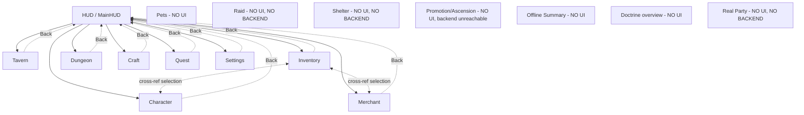

# 06 — Player Flow Map

Can-player-complete values restricted to: YES_STATICALLY, PARTIAL, NO_UI, NO_BACKEND, BROKEN_BINDING, RUNTIME_VERIFICATION_REQUIRED.

| Flow | Step | Screen | User action | Backend call | State mutation | UI state after | Failure state | Missing UI | Backend gap | Can complete | Evidence |
|---|---|---|---|---|---|---|---|---|---|---|---|
| Boot→HQ | Launch | none | app start | DatabaseBuilder.Build, ServiceContainer, SaveService.Load | DB+services ready | HUD shown | fatal DB error only logs, no error screen | Boot error screen | — | PARTIAL (works if DB loads; silent failure otherwise) | UIRuntimeBootstrap.cs:41-153 |
| Fresh-save onboarding | First session | HUD/Tavern | implicit | `SaveData.CreateDefault()` seeds 1 Footman + 500 Money | roster has 1 char | HUD shows 500/0 | n/a | Tutorial/onboarding overlay (TutorialStep exists but drives only Tavern visitor rolls, not any UI tour) | — | PARTIAL (playable but unexplained) | SaveData.cs:282-294 |
| Tavern→Recruit | Select guest, Recruit | TavernScreen | click card, Btn_RecruitSelected | `RecruitGuest` | roster+1, guest removed | feedback text, list refresh | roster full → bool false, generic text | reason-typed failure text | — | YES_STATICALLY | TavernScreen.cs:182-201 |
| Tavern→Send Away | — | TavernScreen | **no such action exists** | — | — | — | — | Send-away/dismiss control | No `DismissGuest`/`FireCharacter` method anywhere in CharacterService/TavernService | NO_BACKEND | backend_trace §7,§9 |
| Quarters→Inspect Adventurer | — | CharacterScreen (closest analog) | select card | none (read-only) | none | detail panel | n/a | Dedicated Quarters roster screen distinct from Character | — | PARTIAL (Character screen substitutes) | CharacterScreen.cs |
| Party Add/Remove | Select char, Add/Remove | CharacterScreen | click buttons | **none** | UI-local `_partyIds` only | button label/state | n/a | Real Party backend + persistence | Confirmed no PartyService | BROKEN_BINDING (UI implies persistence, has none) | CharacterScreen.cs:36,200-216 |
| Character Equip/Unequip | Select item in Inventory, switch to Character, Equip | InventoryScreen+CharacterScreen | Btn_Equip / Btn_UnWpn etc. | `EquipmentService.Equip/Unequip` | slot filled/cleared | text feedback | wrong class → false (Equip only; Unequip result discarded) | equipped-state badge in Inventory (stub always false) | — | YES_STATICALLY (Equip); PARTIAL (Unequip feedback unconditional) | EquipmentService.cs |
| Inventory Inspect/Lock/Use/Sell | select, act | InventoryScreen(+Merchant for sell) | Btn_Lock/Use; Sell redirects to Merchant | `ToggleLockItem`/`UseConsumable`; real sell happens in MerchantScreen | flags/HP/stack change; sell via Merchant | text feedback | n/a | Equip button in Inventory (unbound) | — | PARTIAL (Lock/Use YES; in-place Sell/Equip NO_UI) | InventoryScreen.cs |
| Dungeon Select→Start | pick dungeon+party, Btn_Start | DungeonScreen | click | `StartDungeon` | new DungeonRuntime, party locked | Active panel shown | chain-gate always fails (dead completion write) | Start confirmation popup (party gets committed with no confirm) | Dungeon-completion write missing | YES_STATICALLY for first tier only (chained dungeons NO_BACKEND in practice) | DungeonService.cs:53-102 |
| Dungeon Auto Combat | Btn_AutoBattle | DungeonScreen | click | `Tick()` looped 0.5s | combat state advances | live-ish refresh | n/a | HP/turn progress bars | Status effects never applied (orphaned service) | YES_STATICALLY (mechanically), PARTIAL (feedback quality) | DungeonScreen.cs:305-328; StatusEffectService.cs |
| Dungeon Flee/Defeat/Respawn | automatic on state 5/6 | DungeonScreen | none direct | `PerformAction` state machine | party restored, progress wiped if <250 | Select panel returns (implicit) | no distinct "you were defeated" screen/message found | Defeat/Flee summary screen | — | PARTIAL (happens, but not narrated to player) | DungeonService.cs:239-280,517-528 |
| Dungeon Pending Loot→Collect | Btn_Collect | DungeonScreen (Loot panel) | click | `CollectDrops` | drops→inventory, silently drops overflow | text with count | inventory full mid-collect → silent partial | "N items lost" message | — | PARTIAL | DungeonService.cs:495-516 |
| Quest View→Progress→Claim→Replacement | view, Btn_Claim | QuestScreen | click | `ClaimReward` | Gems/Doctrine credited, quest removed | unconditional success text | return value discarded | Real result-based feedback; **replacement quest never generated** (no Start method exists) | Quest creation missing entirely | NO_BACKEND (no quest can ever newly appear after initial claim path — RUNTIME_VERIFICATION_REQUIRED whether any quests exist on a fresh save at all) | QuestService.cs (no Start method) |
| Doctrine view | — | QuestScreen (partial, cycler only) | Btn_CycleDoctrine | none (local) | changes claim target | label updates | n/a | Doctrine overview screen (progress bars for 8 doctrines) | — | NO_UI (view), PARTIAL (target-pick only) | QuestScreen.cs:29 |
| Workshop Select→Craft→Wait→Claim | select recipe, Btn_Craft, wait, Btn_Claim | CraftScreen | clicks | `TryStartCraft`→`ProgressWorkshop`(auto via GameLoop)→`ClaimCompletedCraft` | ingredients consumed→queue→item | typed feedback | ingredient checklist is fake (always shows available) | accurate ingredient check | Craft duration ignores formula (flat 10s) | YES_STATICALLY (mechanically works), PARTIAL (misleading pre-check) | CraftScreen.cs |
| Market List→Wait→Sold→Collect | Sell in Merchant, wait, Btn_ClaimSold | MerchantScreen | clicks | `SellItem`→`ProgressMarket`(auto)→`ClaimSoldItem` | item→queue→Money | typed feedback | no live timer | Live countdown | Sell duration ignores formula (flat 20s) | YES_STATICALLY | MerchantScreen.cs |
| Shop Buy | Btn_BuyRegular/Special | MerchantScreen | click | `BuyOffer` | Money/Gems debited, item granted | typed feedback | stock likely always empty | — | Merchant stock never populated (BG) | NO_BACKEND in practice (stock population gap) / RUNTIME_VERIFICATION_REQUIRED | MerchantService.cs (stock lists never written) |
| Raid Select→Enter→Win/Fail→Reward | — | none | — | — | — | — | — | Entire Raid flow | No RaidService exists | NO_UI, NO_BACKEND | RaidDefinition.cs (empty class) |
| Pets View/Acquire/Assign/Release | — | none | — | PetService methods exist and are complete | — | — | — | Entire Pets screen | none (backend is actually solid) | NO_UI | PetService.cs |
| Shelter Capacity/Upgrade | — | none | — | — | — | — | — | Entire Shelter flow | No ShelterService; only dead SaveData fields/formulas | NO_UI, NO_BACKEND | SaveData.cs:199-201 |
| Promotion Preview→Confirm | — | none | — | `PromotionService.Promote` exists | — | — | — | Entire Promotion screen | `PromotionDefinition` not registered in DatabaseBuilder — always finds zero promotions | NO_UI, NO_BACKEND (in practice, despite code existing) | PromotionService.cs; DatabaseBuilder.cs:26-38 |
| Ascension Preview→Confirm | — | none | — | same as Promotion | — | — | — | Entire Ascension screen | same as Promotion | NO_UI, NO_BACKEND | CharacterService.cs:178 |
| Settings | toggle, save, reset | SettingsScreen | clicks | `SetToggle`/`SaveCurrentState`/`ResetToDefault` | flags flip, persist on explicit Save | text feedback, 2-step confirm on reset | none for toggles | Cloud toggle control | — | YES_STATICALLY | SettingsScreen.cs |
| Save→Reload | pause/quit | any | implicit | `SaveService.Save` | file written | n/a | write failure only logs | Save-in-progress/failure indicator | — | RUNTIME_VERIFICATION_REQUIRED (cannot confirm actual file I/O without PlayMode) | SaveService.cs:91-123 |
| Offline return | app resume | none | implicit | `GameLoopService.ProcessOfflineCatchup` OR `OfflineProgressService.ApplyOfflineProgress` (ambiguous which fires) | dungeon/craft/market advanced by elapsed time | **no summary shown to player** | n/a | Offline summary popup | Two competing implementations, unclear which is wired; no popup consumes `OfflineProgressResult` | NO_UI (summary), RUNTIME_VERIFICATION_REQUIRED (which service path actually runs) | GameLoopService.cs:39-66; OfflineProgressService.cs:31-62 |

Mermaid overview of current reachable navigation (HUD-centric star topology — every screen returns to HUD via Back, no direct screen-to-screen nav except the Inventory↔Character and Inventory↔Merchant data cross-references):

