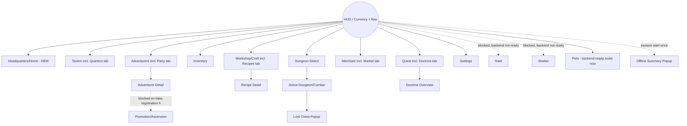

# 07 — Information Architecture

## Persistent HUD
Always visible except during full-screen popups. Shows: Money, Gems (both currently refresh only on HUD `Show()` — Phase 0 must convert this to an event-driven or short-poll refresh since these values change constantly on other screens). Add: quest-notification badge (once quest creation is fixed), tavern-visitor-ready badge, craft/sell-ready badges — all currently invisible without opening each screen.

## Navigation hierarchy (grounded in what actually exists + what's needed)
- **Primary tier (always reachable from HUD):** Headquarters/Home (new — currently HUD *is* the hub with no distinct "home" view beyond currency), Tavern (incl. Quarters sub-tab), Adventurers/Party (Character screen split into Roster + Party sub-tabs), Inventory, Dungeon, Workshop (Craft), Merchant (incl. Market sub-tab), Quest (incl. Doctrine sub-tab), Settings.
- **Secondary tier (reached from a primary screen, not from HUD directly):** Adventurer Detail (from Roster), Recipe Detail (from Workshop), Active Dungeon / Combat (from Dungeon Select), Loot Chest (from Active Dungeon), Market Listing Detail (from Merchant).
- **New systems requiring new primary or secondary entries once backend is ready:** Doctrine overview (secondary, from Quest), Pets (primary — backend already complete, currently zero UI), Promotion/Ascension (secondary, from Adventurer Detail — blocked on backend data-registration fix), Raid (primary — blocked on backend, do not build UI first), Shelter (primary — blocked on backend, do not build UI first).
- **Modal/overlay tier:** Confirm/Cancel dialog (new — does not exist; today only Settings has a bespoke inline 2-step confirm), Offline Summary (new, shown once at session start before HUD), Reward/Loot popup, Error toast, Tooltip.

## Modal/popup policy
One popup slot at a time (matches current `UIService._currentPopup` single-slot design — keep this constraint, it's sound). Introduce a typed `ConfirmPopup` (Yes/No with distinct callbacks) separate from the existing info-only `PopupScreen`, since today's shared dialog literally cannot represent a cancelable choice (`PopupScreen.Awake()` wires OK to `Hide()` only — no callback parameter exists). Every currency-spending or party-committing action identified in `03_Player_Action_And_State_Inventory.md` as "no confirmation dialog" should route through the new ConfirmPopup, gated per-action by a Settings toggle (`confirmswap`, `confirmupgrade`, `confirmretreat` — these three keys **already exist** in `SettingsService.GetToggle`'s switch (`SettingsService.cs:15-37`) but are currently unused by any screen — a ready-made backend contract for exactly this policy).

## Overlay/contextual panels
Detail panel pattern (already used consistently across Character/Craft/Dungeon/Inventory/Merchant/Quest — keep this pattern, it works) stays as an in-screen panel, not a popup, for selection-driven detail (list card → detail panel updates in place). Reserve popups strictly for: confirmation, one-time reward reveal, and errors that block further action.

## Back-stack policy
Current `UIService` stack has two defects to fix in Phase 0: (1) repeated `ShowScreen(X)` calls push duplicate stack entries with no de-dup, so `Back()` may require multiple presses to leave a screen the player never really navigated away from; (2) `Back()` at stack depth ≤1 silently no-ops with no visual affordance telling the player it's a no-op. Recommendation: HUD is always stack-index 0 and never duplicated; `ShowScreen` should no-op (not push) if the target is already the current top of stack.

## Tab behavior
Existing tab pattern (Craft: Recipes/Queue/Completed; Merchant: Buy/Sell/Listings) is sound and should extend to: Character (Roster/Party), Tavern (Recruit/Quarters), Quest (Quests/Doctrine). Tabs persist selection state per-screen-instance but reset to default tab on screen re-entry unless a "last tab" memory is added in Phase 0's screen-state conventions.

## Deep navigation
Adventurer Detail should be reachable from three entry points (Roster card, Party slot, Dungeon party-list card) and must return to whichever screen it was opened from, not always to HUD — current architecture's single global stack supports this already if callers push correctly; this is a convention to establish in Phase 0, not a new mechanism.

## Locked-feature presentation
Systems gated by data that doesn't exist yet (Promotion/Ascension pending the DatabaseBuilder registration fix, Raid/Shelter pending backend build) must NOT get a visible nav entry that leads to a dead/empty screen. Recommendation: omit them from HUD/primary nav until `Must fix before UI: YES` items in `11_Backend_Gap_Register.md` are resolved; Pets (backend already complete) is the one system that can get a real nav entry immediately.

