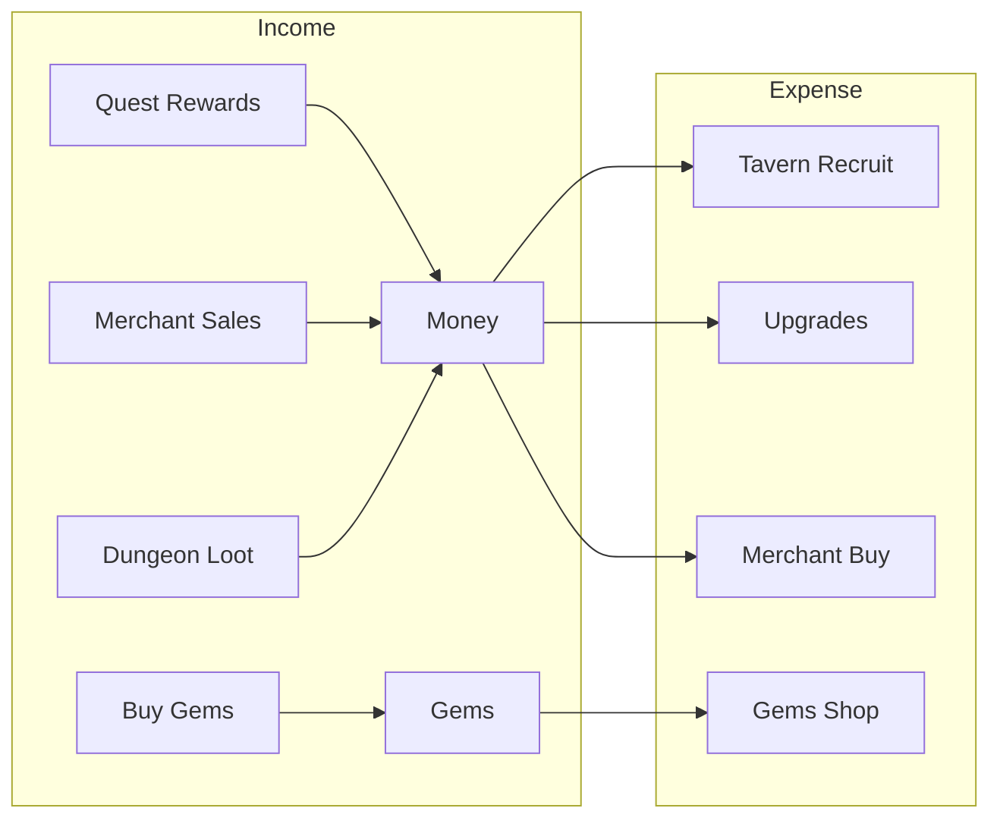

# RESTORE_3 — ECONOMY EXECUTION REPORT
## Generated: 2026-07-29

---

## 1. Craft System

### Full API Trace

| Method | File:Line | SaveData Mutation | Status |
|--------|-----------|-------------------|--------|
| `GetQueueCapacity()` | CraftService.cs:33 | Reads LevelWorkshopQueue via FormulaService | ✅ |
| `GetQueue()` | CraftService.cs:39 | Returns `SaveData.WorkshopQueue.AsReadOnly()` | ✅ |
| `GetCompletedItems()` | CraftService.cs:44 | Returns `SaveData.CompletedWorkshopItems.AsReadOnly()` | ✅ |
| `GetMaxCraftable(recipeId)` | CraftService.cs:49 | Material check against inventory | ✅ |
| `CanCraft(recipeId)` | CraftService.cs:70 | Queue capacity + material check | ✅ |
| `TryStartCraft(recipeId)` | CraftService.cs:110 | Deducts materials → Adds to WorkshopQueue | ✅ |
| `ProgressWorkshop(deltaSec)` | CraftService.cs:144 | Advances queue timers → Completes items | ✅ |
| `ClaimCompletedCraft(instId)` | CraftService.cs:161 | Removes from Completed → Creates item → AddItem | ✅ |

### TryStartCraft — Full Trace

| Step | File:Line | Effect | Status |
|------|-----------|--------|--------|
| Get recipe definition | CraftService.cs:112 | From GameDatabase | ✅ |
| CanCraft check | CraftService.cs:117 | Queue capacity + enough materials | ✅ |
| Deduct materials | CraftService.cs:120-131 | Consumes from Inventory by DefinitionId | ✅ |
| Create ItemActionSaveData | CraftService.cs:132-140 | Sets recipeId, completion time, quantity | ✅ |
| Add to WorkshopQueue | CraftService.cs:140 | `SaveData.WorkshopQueue.Add()` | ✅ |

### ProgressWorkshop (Offline)

| Step | File:Line | Effect | Status |
|------|-----------|--------|--------|
| Iterate queue | CraftService.cs:148 | For each active craft | ✅ |
| Deduct delta from remaining | CraftService.cs:153 | `remaining -= deltaSeconds` | ✅ |
| Complete item when done | CraftService.cs:157 | Move to CompletedWorkshopItems | ✅ |

### ClaimCompletedCraft — Full Trace

| Step | File:Line | Effect | Status |
|------|-----------|--------|--------|
| Find completed item by ID | CraftService.cs:165 | From CompletedWorkshopItems | ✅ |
| Get item definition | CraftService.cs:170 | Create item via ItemService | ✅ |
| Add to inventory | CraftService.cs:175 | `_inventoryService.AddItem(newItem)` | ✅ |
| Remove from completed | CraftService.cs:179 | Remove from CompletedWorkshopItems | ✅ |
| Increment ItemsCrafted stat | CraftService.cs:181 | `SaveData.ItemsCrafted++` | ✅ |

---

## 2. Merchant System

### Full API Trace

| Method | File:Line | SaveData Mutation | Status |
|--------|-----------|-------------------|--------|
| `GetRegularStock()` | MerchantService.cs:27 | Returns `SaveData.MerchantRegularStockItems` | ✅ |
| `GetSpecialStock()` | MerchantService.cs:32 | Returns `SaveData.MerchantSpecialReserve` | ✅ |
| `RollRegularOffer(dungeonId)` | MerchantService.cs:37 | Generates new offer from dungeon table | ✅ |
| `RollSpecialOffer(dungeonId)` | MerchantService.cs:45 | Generates special offer | ✅ |
| `BuyOffer(offer, isSpecial)` | MerchantService.cs:78 | Deducts Money/Gems → Removes from stock | ✅ |
| `BuyItem(dungeonId, itemId)` | MerchantService.cs:118 | Wrapper for BuyOffer | ✅ |
| `SellItem(defId, stackCount)` | MerchantService.cs:123 | Removes from Inventory → Adds listing | ✅ |
| `ProgressMarket(deltaSec)` | MerchantService.cs:149 | Expires listings → Marks sold | ✅ |
| `ClaimSoldItem(instanceId)` | MerchantService.cs:166 | Adds Money → Removes listing | ✅ |

### BuyOffer — Full Trace

| Step | File:Line | Effect | Status |
|------|-----------|--------|--------|
| Check currency type (Rule #1) | MerchantService.cs:91-97 | Money vs Gems check | ✅ |
| Deduct price | MerchantService.cs:101-102 | `data.Money -= price` or `data.Gems -= price` | ✅ |
| Create item | MerchantService.cs:108 | `ItemService.CreateItem(offer.DefinitionId)` | ✅ |
| Add to inventory | MerchantService.cs:111 | `_inventoryService.AddItem(item)` | ✅ |
| Remove offer from stock | MerchantService.cs:105-106 | Regular or Special removal | ✅ |

### SellItem — Full Trace

| Step | File:Line | Effect | Status |
|------|-----------|--------|--------|
| Check item not locked | MerchantService.cs:136 | Lock check | ✅ |
| Remove from inventory | MerchantService.cs:137 | `_inventoryService.RemoveItem()` | ✅ |
| Create MarketListing | MerchantService.cs:140-144 | ItemActionSaveData with sell price + timeout | ✅ |
| Add to MarketListings | MerchantService.cs:144 | `SaveData.MarketListings.Add()` | ✅ |

### ClaimSoldItem — Full Trace

| Step | File:Line | Effect | Status |
|------|-----------|--------|--------|
| Find listing by ID | MerchantService.cs:169 | From MarketListings | ✅ |
| Get listing price | MerchantService.cs:172 | From ItemActionSaveData | ✅ |
| Add Money | MerchantService.cs:181 | `SaveData.Money += totalEarned` | ✅ |
| Remove from listings | MerchantService.cs:183 | `SaveData.MarketListings.Remove()` | ✅ |

### ProgressMarket (Offline)

| Step | File:Line | Effect | Status |
|------|-----------|--------|--------|
| Iterate listings | MerchantService.cs:153 | For each pending sale | ✅ |
| Check sell timer | MerchantService.cs:155 | If elapsed → mark sold | ✅ |
| Items accumulate earnable gold | — | Stored on listing data | ✅ |

---

## 3. Economy Balance — FormulaService Costs

| Cost | FormulaService Method | Used By | Status |
|------|----------------------|---------|--------|
| Tavern recruit | `RecruitCost()` | TavernService.RecruitGuest() | ✅ |
| Upgrade quarters | `UpgradeCost("quarters", level)` | TavernService.UpgradeQuarters() | ✅ |
| Upgrade tavern capacity | `UpgradeCost("tavern_capacity", level)` | TavernService.UpgradeTavernCapacity() | ✅ |
| Upgrade tavern time | `UpgradeCost("tavern_time", level)` | TavernService.UpgradeTavernTime() | ✅ |
| Craft material cost | Formula for material deduction | CraftService.TryStartCraft() | ✅ |
| Merchant buy | `ComputeBuyPrice(def, dungeonId)` | MerchantService.BuyOffer() | ✅ |
| Merchant sell | Formula on item sell value | MerchantService.SellItem() | ✅ |
| Market sell price | Percentage formula | MerchantService.SellItem() | ✅ |
| Workshop queue cap | `WorkshopQueue(level, upgrade, flags)` | CraftService.GetQueueCapacity() | ✅ |

### Gold/Gems Flow

| Income Source | SaveData Target | Status |
|--------------|----------------|--------|
| Quest reward (gold) | via DoctrineService only | ⚠️ No gold reward |
| Quest reward (gems) | `SaveData.Gems` in ClaimReward | ✅ |
| Merchant sell | `SaveData.Money` in ClaimSoldItem | ✅ |
| Dungeon loot | Items only (not raw currency) | ⚠️ Items only |

| Expense Source | SaveData Target | Status |
|---------------|----------------|--------|
| Tavern recruit | `SaveData.Money` in RecruitGuest | ✅ |
| Upgrades | `SaveData.Money` in Upgrade* | ✅ |
| Merchant buy | `SaveData.Money/Gems` in BuyOffer | ✅ |
| Craft material | Inventory ConsumeByDefinitionId | ✅ |

---

## Verification Gate — PASS Criteria

| Check | Status |
|-------|--------|
| CraftScreen opens from HUD | `NOT_RUN` (needs Unity) |
| TryStartCraft → deduct → queue | ✅ STATIC_TRACE_CONFIRMED |
| ClaimCompletedCraft → AddItem → remove | ✅ STATIC_TRACE_CONFIRMED |
| Craft progress bar visible | ❌ NOT_PRESENT (G10) |
| MerchantScreen opens from HUD | `NOT_RUN` (needs Unity) |
| BuyOffer → deduct → add → remove stock | ✅ STATIC_TRACE_CONFIRMED |
| SellItem → remove → listing | ✅ STATIC_TRACE_CONFIRMED |
| ClaimSoldItem → add gold → remove listing | ✅ STATIC_TRACE_CONFIRMED |
| Market refresh countdown visible | ❌ NOT_PRESENT (G11) |
| FormulaService costs traced | ✅ CONFIRMED |
| Gold/gems income + expense traced | ✅ CONFIRMED |

---

## Phase Exit Verdict

| Criterion | Verdict |
|-----------|---------|
| Craft service wired | ✅ All methods traceable, SaveData mutations confirmed |
| Merchant service wired | ✅ All methods traceable, SaveData mutations confirmed |
| Gold/gems flow | ✅ Income + expense sources mapped |
| Craft progress bar | ❌ NOT_PRESENT (G10 — new UI element) |
| Market refresh timer | ❌ NOT_PRESENT (G11 — new UI element) |
| **Phase exit** | ⚠️ **PARTIAL — Craft and Merchant fully traced, 2 UI gaps** |
