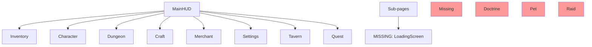

# UI AUDIT REPORT
## Generated: 2026-07-29

---

## 1. Screen Registration Audit

| Screen | UIScreenId enum | Screen class | Service registration | Status |
|--------|----------------|--------------|---------------------|--------|
| **Loading** | ✅ `Loading` | ❌ No LoadingScreen.cs | ❌ Not registered | ⚠️ MISSING_IMPL |
| **MainHUD** | ✅ `MainHUD` | ✅ HUDController.cs | ✅ Registered | ✅ |
| **MainMenu** | ✅ `MainMenu` | ❌ No MainMenuScreen.cs | ❌ Not registered | ⚠️ MISSING_IMPL |
| **Inventory** | ✅ `Inventory` | ✅ InventoryScreen.cs | ✅ Registered | ✅ |
| **Character** | ✅ `Character` | ✅ CharacterScreen.cs | ✅ Registered | ✅ |
| **Dungeon** | ✅ `Dungeon` | ✅ DungeonScreen.cs | ✅ Registered | ✅ |
| **Craft** | ✅ `Craft` | ✅ CraftScreen.cs | ✅ Registered | ✅ |
| **Merchant** | ✅ `Merchant` | ✅ MerchantScreen.cs | ✅ Registered | ✅ |
| **Settings** | ✅ `Settings` | ✅ SettingsScreen.cs | ✅ Registered | ✅ |
| **Tavern** | ✅ `Tavern` | ✅ TavernScreen.cs | ✅ Registered | ✅ |
| **Quest** | ✅ `Quest` | ✅ QuestScreen.cs | ✅ Registered | ✅ |
| **Doctrine** | ❌ Missing | ❌ No DoctrineScreen.cs | ❌ Not registered | ❌ NEEDS_ADD (G04) |
| **Pet** | ❌ Missing | ❌ No PetScreen.cs | ❌ Not registered | ❌ NEEDS_ADD (G01) |
| **Raid** | ❌ Missing | ❌ No RaidScreen.cs | ❌ Not registered | ❌ NEEDS_ADD (G08) |
| **Promotion** | ❌ Missing | ❌ No PromotionScreen.cs | ❌ Not registered | ❌ NEEDS_ADD (G03) |

---

## 2. UIService Architecture

| Feature | Status | Notes |
|---------|--------|-------|
| RegisterScreen | ✅ | Safe (null-checked, Hide by default) |
| ShowScreen | ✅ | With not-registered warning |
| HideScreen | ✅ | Safe with TryGetValue |
| Back | ✅ | Stack-based navigation |
| ShowPopup | ✅ | CurrentPopup tracking |
| HideCurrentPopup | ✅ | Safe cleared on unhide |

---

## 3. Individual Screen Analysis

### MainHUD (HUDController)
| Check | Status | Notes |
|-------|--------|-------|
| Money display | ✅ | Shows SaveData.Money |
| Gems display | ✅ | Shows SaveData.Gems |
| Navigation buttons | ✅ | Opens Inventory, Dungeon, Craft, Merchant, Settings, Tavern, Quest |

### CharacterScreen
| Check | Status | Notes |
|-------|--------|-------|
| Character list | ✅ | Shows all SaveData.Characters |
| Detail panel | ✅ | Stats, equipment slots |
| Equip button | ✅ | Calls EquipmentService.Equip() |
| Unequip button | ✅ | Calls EquipmentService.Unequip() |
| Ascension/Ascend button | ❌ NOT_PRESENT | G02 — no UI for ascension |

### TavernScreen
| Check | Status | Notes |
|-------|--------|-------|
| Guest list | ✅ | Shows TavernGuests |
| Recruit button | ✅ | Calls TavernService.RecruitGuest() |
| Upgrade buttons | ✅ | Quarters, Capacity, Time upgrades |
| Offline timer | ❌ NOT_PRESENT | No countdown/refresh timer visible |

### InventoryScreen
| Check | Status | Notes |
|-------|--------|-------|
| Item grid | ✅ | Shows all inventory items |
| Lock/Unlock | ✅ | ToggleLockItem with label swap |
| Item detail | ✅ | Shows stats, description |
| Sell from inventory | ❌ NOT_PRESENT | Sell is handled from MerchantScreen |

### DungeonScreen
| Check | Status | Notes |
|-------|--------|-------|
| Dungeon list | ✅ | Shows available dungeons |
| Start button | ✅ | Calls DungeonService.StartDungeon() |
| Combat display | ✅ | Turn-based display |
| Loot display | ✅ | Shows PendingDrops after combat |
| Locked dungeon indicator | ❌ NOT_PRESENT | G05 — no lock icon for chained dungeons |

### CraftScreen
| Check | Status | Notes |
|-------|--------|-------|
| Recipe list | ✅ | Shows craftable recipes |
| Craft button | ✅ | Calls CraftService.TryStartCraft() |
| Queue display | ✅ | Shows WorkshopQueue |
| Completed items | ✅ | Shows CompletedWorkshopItems |
| Craft progress bar | ❌ NOT_PRESENT | G10 — no visual timer |

### MerchantScreen
| Check | Status | Notes |
|-------|--------|-------|
| Regular stock | ✅ | Shows MerchantRegularStockItems |
| Special stock | ✅ | Shows MerchantSpecialReserve |
| Buy button | ✅ | Calls MerchantService.BuyOffer() |
| Sell button | ✅ | Calls MerchantService.SellItem() |
| Market listings | ✅ | Shows MarketListings |
| Claim sold button | ✅ | Calls ClaimSoldItem() |
| Market timer | ❌ NOT_PRESENT | G11 — no refresh countdown |

### QuestScreen
| Check | Status | Notes |
|-------|--------|-------|
| Quest list | ✅ | Shows active quests |
| Progress display | ✅ | Shows current/value for quests |
| Claim reward button | ✅ | Calls QuestService.ClaimReward() |
| Quest → caller mapping | ❌ MISSING | Quests never progress (56/56 missing) |

### SettingsScreen
| Check | Status | Notes |
|-------|--------|-------|
| Sound toggle | ✅ | SaveData.SettingsSound |
| Music toggle | ✅ | SaveData.SettingsMusic |
| Reset button | ✅ | Confirm dialog → CreateDefault() + Save() |
| LoadingScreen | ❌ NOT_PRESENT | No loading screen for transition |

---

## 4. Missing Screens Summary

| Missing Screen | GAP | Effort | Priority |
|---------------|-----|--------|----------|
| LoadingScreen | G12 | ~0.5d | MEDIUM — needed for polish |
| DoctrineScreen | G04 | ~1d | MEDIUM — backend ready |
| MainMenuScreen | — | ~0.5d | LOW — game boots direct to HUD |
| PetScreen | G01 | ~1d | FUTURE — needs PetService first |
| RaidScreen | G08 | ~1d | FUTURE — needs RaidService first |
| PromotionScreen | G03 | ~0.5d | FUTURE — needs PromotionService first |
| Ascension UI elements | G02 | ~0.25d | MEDIUM — add to CharacterScreen |

---

## 5. HUD → Screen Navigation

---

## 6. UI Verdict

| Metric | Score |
|--------|-------|
| Screens implemented | 10/16 (63%) |
| Missing screens | 6/16 (38%) |
| HUD navigation | ✅ 8 buttons → 8 screens |
| Missing: DoctrineScreen | ❌ Blocked by G04 |
| Missing: PetScreen | ❌ Blocked by G01 |
| Missing: RaidScreen | ❌ Blocked by G08 |
| Missing: PromotionScreen | ❌ Blocked by G03 |
| Missing: LoadingScreen | ❌ Blocked by G12 |
| Missing: MainMenuScreen | ⚠️ Not needed for direct-launch MVP |
| Screens need minor fixes | 2 (craft bar G10, market timer G11) |
| Screens need major fixes | 1 (CharacterScreen + ascension G02) |
